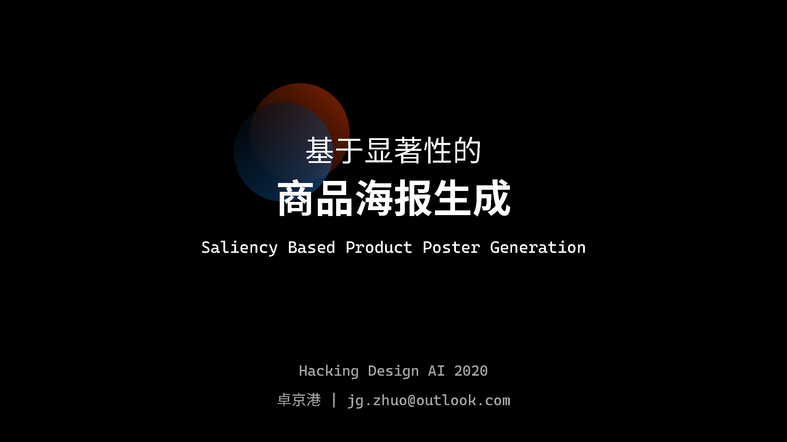

# Hacking Design AI 2020

## 👨‍💻Introduction

This repo is for course `Hacking Design AI 2020`. You can find my final project and homework here.  

## 📑Final Project

### [Saliency Based Product Poster Generation](final/README.md)  

## 📄Homework  

### [Level 01](homework/level01_intelligent_design.ipynb)  

>### 选择⼀篇论⽂进⾏研究，提交学习笔记
>
>重点关注从论⽂中吸取的经验，⽤于改进本课程的智能设计软件架构
>
>### 绘制详细的智能设计软件架构图
>
>加⼊⾃⼰的⻅解，改进部分容器、组件
>
>### 编写代码⻣架notebook

### [Level 02-1](homework/level02-1_color-match.ipynb)  

>### 设计一个自动配色的算法，以架构图的方式、代码的方式提交
>
>提示：利⽤本节课介绍的知识，可以搭建⼀个，但肯定还有很多可以提升的余地。  
>
>#### STEP01 定义输入输出
>
>举例：定义输⼊：某个颜⾊rgb；输出：3个可搭配的颜⾊rgb及⽐例  
>
>#### STEP02 分类rgb到某个颜色（或色相）
>
>#### STEP03 根据分类后的颜色，返回搭配的其他⾊彩
>
>举例:可以预先设定色彩搭配模板，也可以根据色彩规律计算，还可以有哪些⽅法？

### [Level 02-2](homework/level02-2_design-map.ipynb)  

>### 应⽤图谱到某个设计场景
>
>提示：思考下设计流程⾥哪个环节适合使⽤图谱。  
>
>#### STEP01 寻找商业价值最⼤的应⽤场景  
>
>#### STEP02 设计技术架构  
>
>#### STEP03 简单的代码实现demo  

### [Level 02-3](homework/level02-3_design-analysis-alignment.ipynb)  

>### 设计一个用于平面设计的图像理解模块
>
>提示：此模块提供什么能力？
>
>比如 构图类型、显著区域、文字区域、裁切方式
>
>架构图、代码notebook

### [Level 02-4](homework/level02-4_design-layout.ipynb)  

>### 设计一个自动排版模块
>
>提示：选择合适的方法，完成
>
>架构图、代码Notebook

## 💻Environment

All the notebooks and code are tested on:  

* Windows 10 Version 2004  
* Anaconda 4.6.14  

### External Lib

[ImageAI](https://github.com/OlafenwaMoses/ImageAI) for object detection.  
[Katna](https://katna.readthedocs.io/en/latest/index.html) for intelligent image crop.  
[pyimgsaliency](https://github.com/yhenon/pyimgsaliency) for visual saliency detection.  

You need to install `ImageAI` and `Katna` according to the link.  
The code for `pyimgsaliency` is included in the folder `external_lib`.
