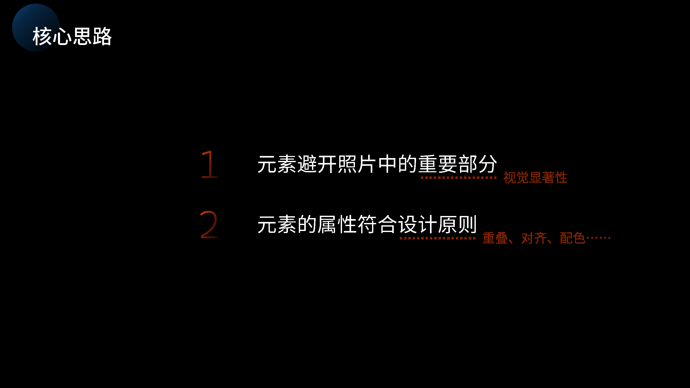
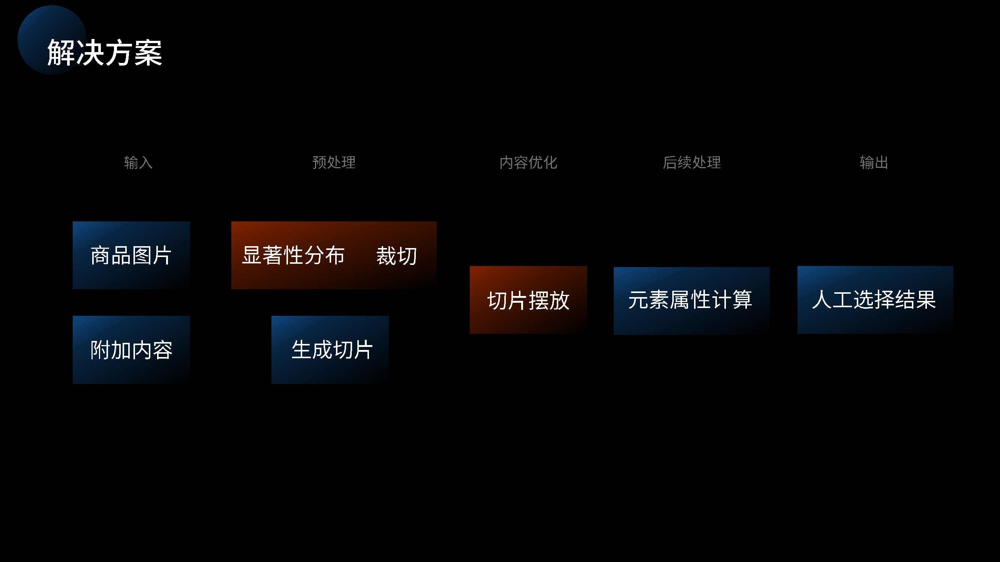
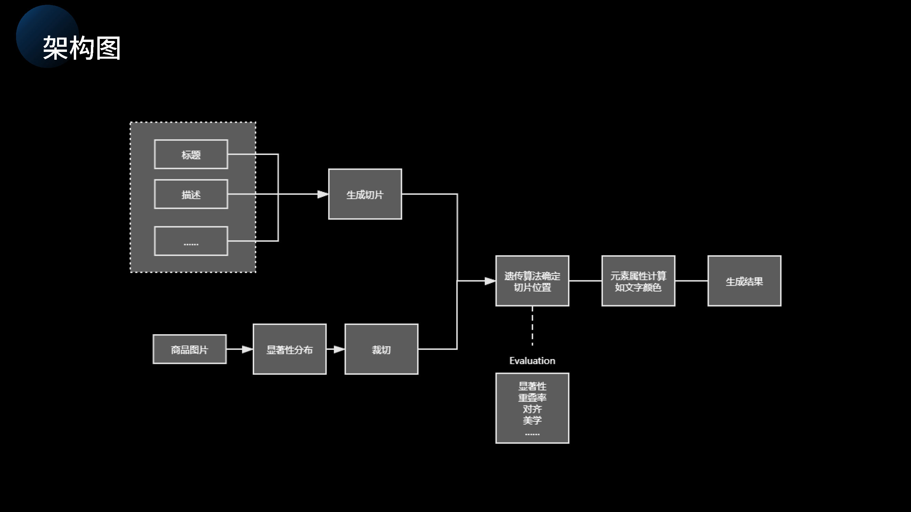
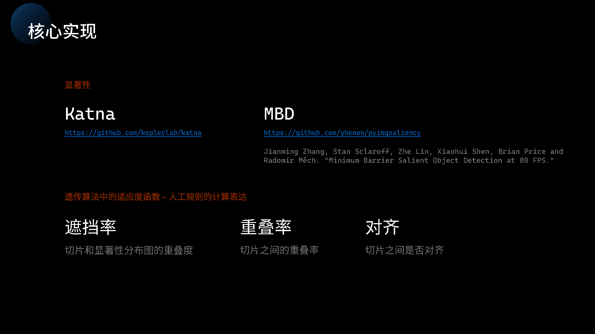
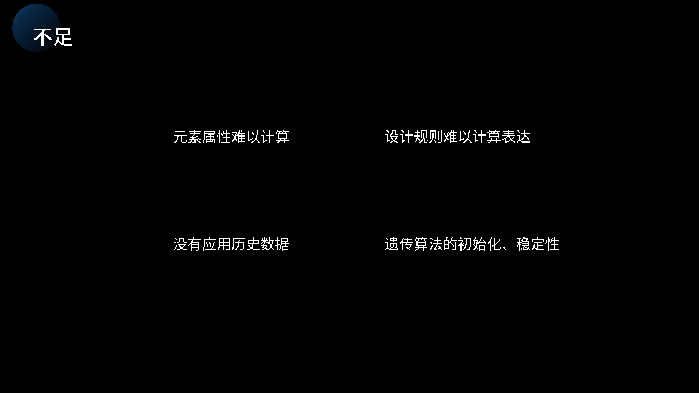

# Saliency Based Poster Layout  

## Demo  

Firstly, create a new envrionment using virtualenv or conda.

```shell
conda create -n hacking-design-ai python=3.6
conda activate hacking-design-ai
```

Then install the requirements.

```shell
pip install -r requirements.txt
```

Then run the `main.py`.

```shell
python main.py
```

Besides, `final_demo.ipynd` contains the demo for **visual saliency** and **intelligent image crop**.

## Background  


## Solution  




## Framework  



## Implementation  



## Result


## Future Working


